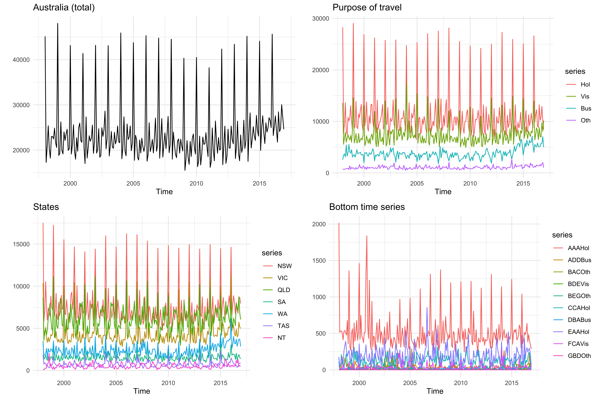
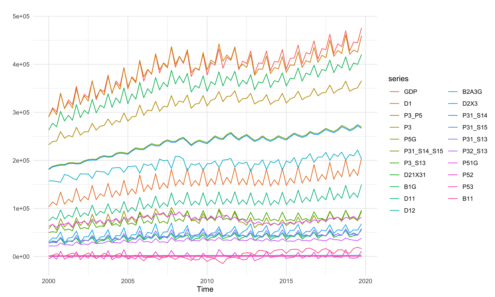
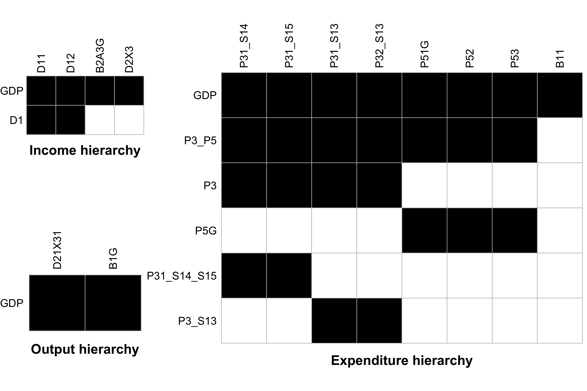
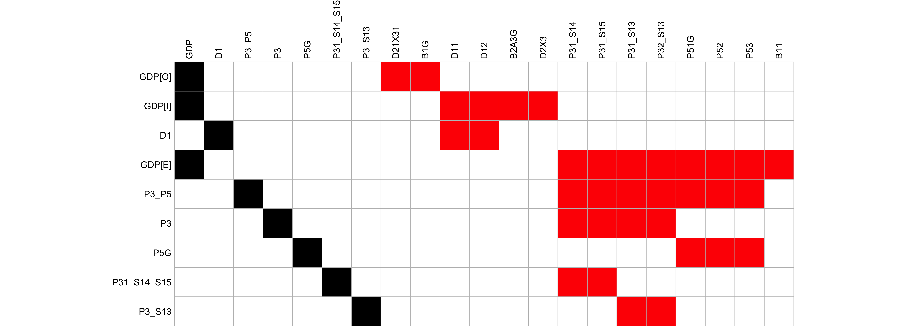
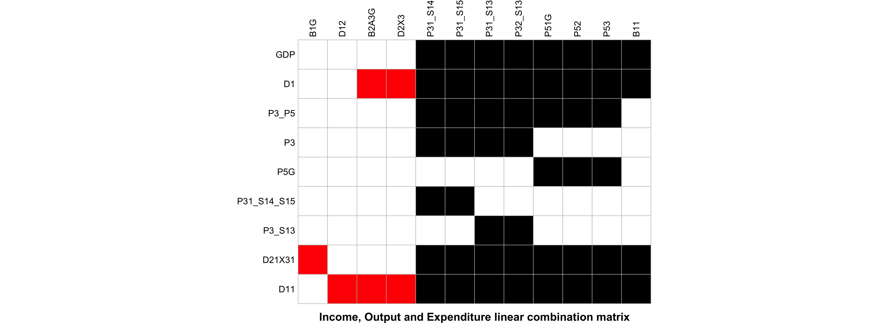

# The vndata and itagdp dataset

## Introduction

Load the packages:

``` r

library(FoReco) # the datasets

# Plot and analysis
library(ggplot2) 
library(forecast) 
library(gridExtra)
library(reshape2)
```

## `vndata`: Groupped monthly time series


Australian Tourism Demand cross-sectional and temporal structure

The Australian Tourism Demand dataset ([Girolimetto et al.,
2024](#ref-Girolimetto2023-jm); [Wickramasuriya et al.,
2018](#ref-Wickramasuriya2019)) measures the number of nights
Australians spent away from home. It includes 228 monthly observations
of Visitor Nights (VNs) from January 1998 to December 2016, and has a
cross-sectional grouped structure based on a geographic hierarchy
crossed by purpose of travel. The monthly bottom times series are
available at
[robjhyndman.com/data/TourismData_v3.csv](https://robjhyndman.com/data/TourismData_v3.csv).

``` r

# Dataset
data(vndata) 
str(vndata)
#>  Time-Series [1:228, 1:525] from 1998 to 2017: 45151 17295 20725 25389 20330 ...
#>  - attr(*, "dimnames")=List of 2
#>   ..$ : NULL
#>   ..$ : chr [1:525] "Total" "A" "B" "C" ...

# Aggregation matrix
data(vnaggmat)
str(vnaggmat)
#>  int [1:221, 1:304] 1 1 0 0 0 0 0 0 1 0 ...
#>  - attr(*, "dimnames")=List of 2
#>   ..$ : chr [1:221] "Total" "A" "B" "C" ...
#>   ..$ : chr [1:304] "AAAHol" "AAAVis" "AAABus" "AAAOth" ...

id_bts <- colnames(vnaggmat)[round(seq(1, NCOL(vnaggmat), length.out = 10))]
states <- c("NSW", "VIC", "QLD", "SA", "WA", "TAS", "NT")
colnames(vndata)[colnames(vndata) %in% LETTERS[1:7]] <- states

marrangeGrob(list(autoplot(vndata[,"Total"], y = NULL, 
         main = "Australia (total)") + theme_minimal(),
autoplot(vndata[, states], y = NULL, 
         main = "States") + theme_minimal(),
autoplot(vndata[, c("Hol", "Vis", "Bus", "Oth")], y = NULL, 
         main = "Purpose of travel") + theme_minimal(),
autoplot(vndata[,id_bts], y = NULL, 
         main = "Bottom time series") + theme_minimal()), 
             top = NULL, nrow = 2, ncol = 2)
```



The geographic hierarchy comprises 7 states, 27 zones, and 76 regions,
for a total of 111 nested geographic divisions. Six of these zones are
each formed by a single region, resulting in 105 unique nodes in the
hierarchy. The purpose of travel comprises four categories: holiday,
visiting friends and relatives, business, and other. To avoid
redundancies ([Di Fonzo & Girolimetto, 2024](#ref-DiFonzo2024-ijf)), 24
nodes (6 zones are formed by a single region) are not considered,
resulting in an unbalanced hierarchy of 525 unique nodes instead of the
theoretical 555 with duplicated nodes. The data can be temporally
aggregated into two, three, four, six, or twelve months
(\\\mathcal{K}=\\12, 6, 4, 3, 2, 1\\\\).


Figure 1: A simple unbalanced hierarchy (left) and its balanced version
(right). Source: Di Fonzo & Girolimetto ([2024](#ref-DiFonzo2024-ijf)).

## `itagdp`: general linearly constrained multiple quarterly time series

The National Accounts are a coherent and consistent set of macroeconomic
indicators that are used mostly for economic research and forecasting,
policy design, and coordination mechanisms. In this dataset, GDP is a
key macroeconomic quantity that is measured using three main approaches,
namely output (or production), income and expenditure. These parallel
systems internally present a well-defned hierarchical structure of
variables with relevant economic signifcance, such as Final consumption,
on the expenditure side, Gross operating surplus and mixed income on the
income side, and Total gross value added on the output side. In the EU
countries, the data is processed on the basis of the ESA 2010
classifcation and are released by Eurostat. The dataset `itagdp`
(<https://ec.europa.eu/eurostat/web/national-accounts/>) contains the
Italian Gross Domestic Product (GDP) at at current prices (in euro),
with time series spanning the period 2000:Q1-2019:Q4.

``` r

# Dataset
data(itagdp) 
str(itagdp)
#>  Time-Series [1:80, 1:21] from 2000 to 2020: 290847 309761 301049 339856 307934 ...
#>  - attr(*, "dimnames")=List of 2
#>   ..$ : NULL
#>   ..$ : chr [1:21] "GDP" "D1" "P3_P5" "P3" ...
autoplot(itagdp, y = NULL) + theme_minimal()
```



The output, income and expenditure approaches are represented as three
differente hierarchies that share the same top-level series (\\GDP\\),
but not the bottom-level series.

``` r

plot_mat <- function(mat, font_size = 8, caption_label = NULL){
    melt(mat) |>
    ggplot(aes(x = Var2, y = Var1)) + 
    geom_tile(aes(fill=as.character(value)), color = "grey") + 
    scale_fill_manual(values = c("-1" = "red", "0" = "white", "1" = "black")) +
    labs(x=NULL, y=NULL, title=NULL) +
    scale_y_discrete(limits=rev) + 
    scale_x_discrete(position = "top") +
    labs(caption = caption_label) +
    coord_fixed() + 
    theme_void() +
    theme(axis.text.x=element_text(size=font_size, vjust=0.5, angle = 90, hjust=0),
          axis.text.y=element_text(size=font_size, hjust=1), 
          plot.caption = element_text(size=rel(0.9), hjust=0.5, face = "bold"),
          legend.position = "none")

}
marrangeGrob(list(plot_mat(incside$agg_mat, caption_label = "Income hierarchy"),
                  plot_mat(outside$agg_mat, caption_label = "Output hierarchy"), 
                  plot_mat(expside$agg_mat, caption_label = "Expenditure hierarchy")), 
             top = NULL, layout_matrix = matrix(c(1, 2, 3, 3, 3, 3, 3,3), 2, 4))
```



The complete \\(9 \times 21)\\ zero constraints matrix encompassing
output, expenditure and income sides is represented in the following
figure.

``` r

rownames(gdpconsmat)[c(1,2,4)] <- c("GDP[O]", "GDP[I]", "GDP[E]")
rownames(gdpconsmat)[-c(1,2,4)] <- colnames(gdpconsmat)[2:7] 
plot_mat(gdpconsmat)
```



A linear combination matrix for a general linearly constrained multiple
time series may be construct ([Girolimetto & Di Fonzo,
2023](#ref-Girolimetto2023-ft)).

``` r

obj <- lcmat(gdpconsmat) 
A <- obj$agg_mat
plot_mat(as.matrix(A), caption_label = "Income, Output and Expenditure linear combination matrix")
```



## References

Di Fonzo, T., & Girolimetto, D. (2024). Forecast combination-based
forecast reconciliation: Insights and extensions. *International Journal
of Forecasting*, *40*(2), 490–514.
<https://doi.org/10.1016/j.ijforecast.2022.07.001>

Girolimetto, D., Athanasopoulos, G., Di Fonzo, T., & Hyndman, R. J.
(2024). Cross-temporal probabilistic forecast reconciliation:
Methodological and practical issues. *International Journal of
Forecasting*, *40*(3), 1134–1151.
<https://doi.org/10.1016/j.ijforecast.2023.10.003>

Girolimetto, D., & Di Fonzo, T. (2023). Point and probabilistic forecast
reconciliation for general linearly constrained multiple time series.
*Statistical Methods & Applications*.
<https://doi.org/10.1007/s10260-023-00738-6>

Wickramasuriya, S. L., Athanasopoulos, G., & Hyndman, R. J. (2018).
Optimal Forecast Reconciliation for Hierarchical and Grouped Time Series
Through Trace Minimization. *Journal of the American Statistical
Association*, *114*(526), 804–819.
<https://doi.org/10.1080/01621459.2018.1448825>
