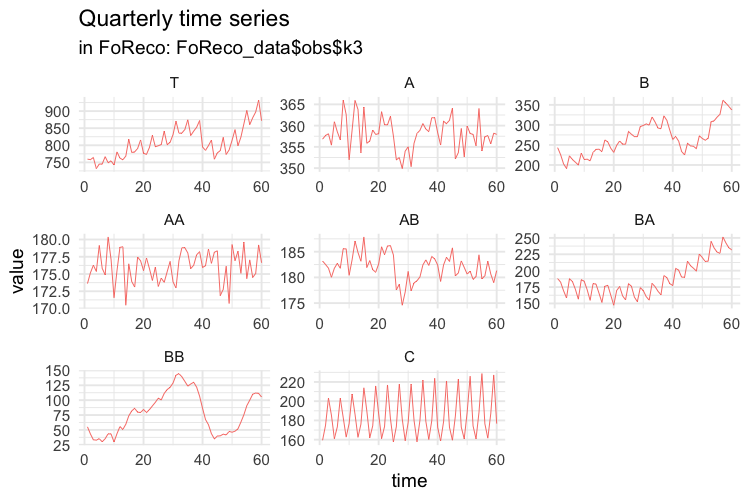
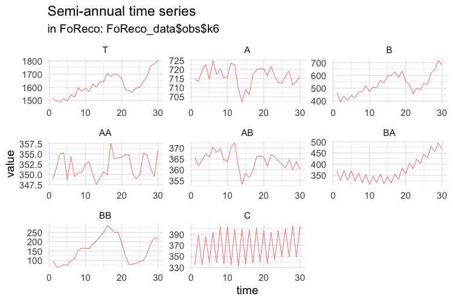
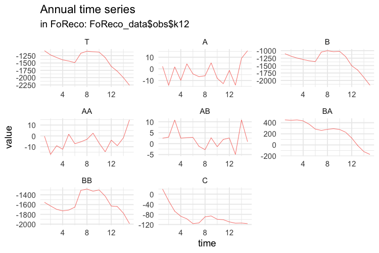
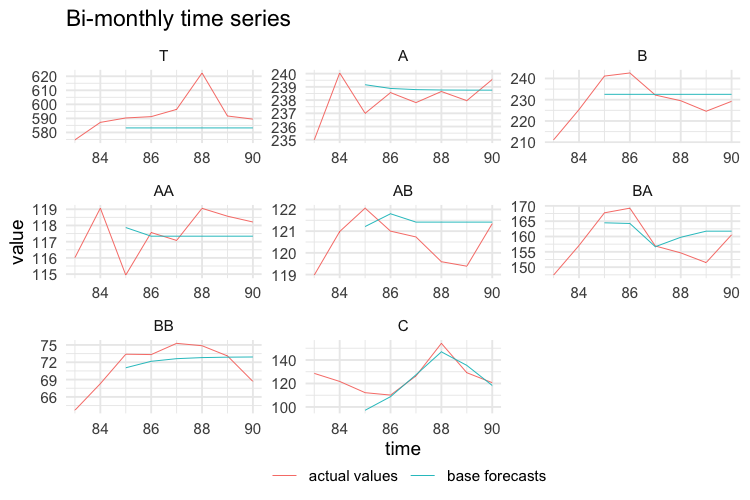
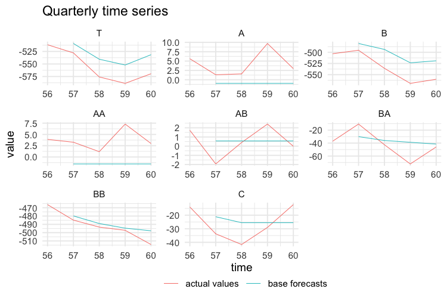
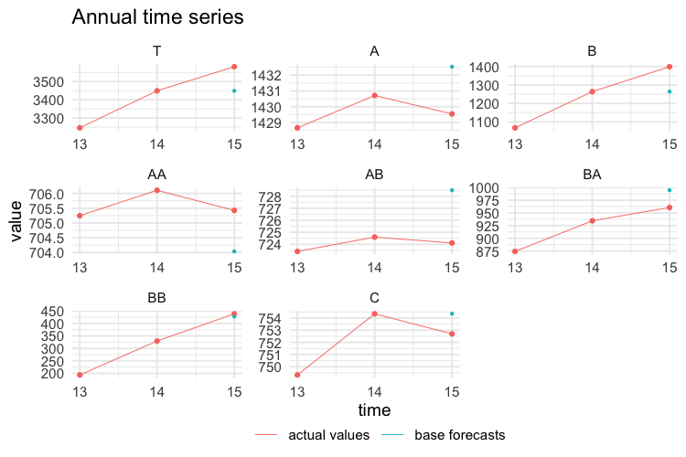
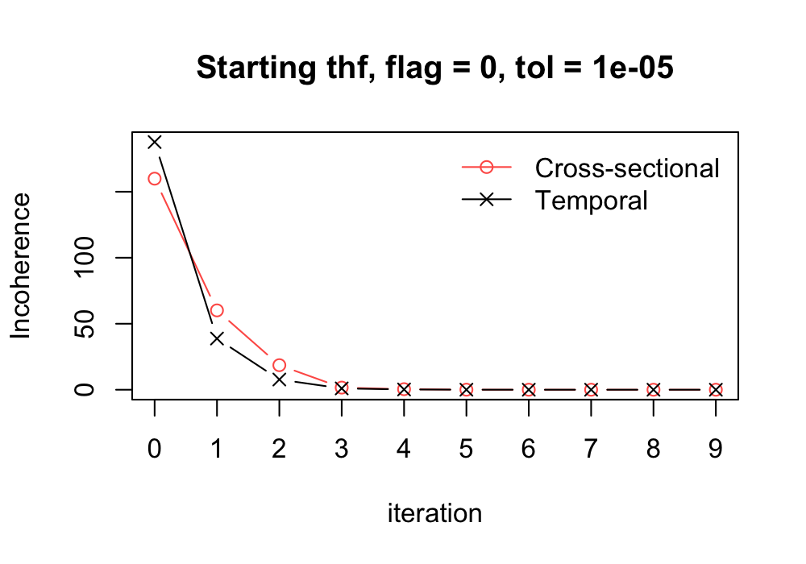

```{r, include = FALSE}
knitr::opts_chunk$set(
  collapse = TRUE,
  comment = "#>",
  warning = FALSE,
  message = FALSE,
  fig.align = "center",
  fig.path = "../man/figures/",
  cache.path = "../inst/cache/")
```

The **FoReco** (**Fo**recast **Reco**nciliation) package is designed for point forecast reconciliation, a **post-forecasting** process aimed to improve the quality of the base forecasts for a system of linearly constrained (e.g. hierarchical/grouped) time series.

It offers classical (bottom-up), optimal and heuristic combination forecast reconciliation procedures by exploiting cross-sectional, temporal, and cross-temporal relationships linking the time series.

### What are the most important functions?
The main functions are:

* `htsrec()`: cross-sectional (contemporaneous) forecast reconciliation.
* `thfrec()`: forecast reconciliation for a single time series through temporal hierarchies.
* `tcsrec()`: heuristic first-temporal-then-cross-sectional cross-temporal forecast reconciliation.
* `cstrec()`: heuristic first-cross-sectional-then-temporal cross-temporal forecast reconciliation.
* `iterec()`: heuristic iterative cross-temporal forecast reconciliation.
* `octrec()`: optimal cross-temporal forecast reconciliation.

### Installation
You can install the **stable** version on [R CRAN](https://cran.r-project.org/).

```{r eval = FALSE}
install.packages('FoReco', dependencies = TRUE)
```

You can also install the **development** version from
[Github](https://github.com/daniGiro/FoReco)

```{r eval = FALSE}
# install.packages("devtools")
devtools::install_github("daniGiro/FoReco")
```

### Example: cross-temporal data
A two-level hierarchy with $n = 8$ monthly time series. In the cross-sectional framework, at any time it is $Tot = A + B + C$, $A = AA + AB$ and $B = BA + BB$ ($nb = 5$  at the bottom level). For monthly data, the observations are aggregated to annual $(k = 12)$, semi-annual $(k = 6)$, four-monthly $(k = 4)$, quarterly $(k = 3)$, and bi-monthly $(k = 2)$ observations. The monthly bottom time series are simulated from five different **SARIMA** models. There are 180 monthly observations  (15 years): the first 168 values (14 years) are used as training set, and the last 12 form the test set.

```{r echo=FALSE, out.width = "500px", fig.cap="Cross-sectional hierarchy"}
knitr::include_graphics("../man/figures/hier.png")
```

#### Simulation
In the following script we simulate five independent monthly bottom time series, each of length 180 (15 complete years of monthly data).
```{r eval = FALSE}
library(FoReco)
library(forecast)
library(sarima)
values <- NULL
base <- NULL
residuals <- NULL
test <- NULL

bottom <- matrix(NA, nrow = 180, ncol = 5)
# Model definition
bts <- list()
#ARIMA(1,0,0)(0,0,0)[12]
bts[[1]] <- list(ar=0.31,
                 nseasons=12)
#ARIMA(0,0,1)(0,0,0)[12]
bts[[2]] <- list(ma=0.61,
                 nseasons=12)
#ARIMA(0,1,1)(0,1,1)[12]
bts[[3]] <- list(ma=-0.1,
                 sma=-0.12,
                 iorder=1,
                 siorder=1,
                 nseasons=12)
#ARIMA(2,1,0)(0,0,0)[12]
bts[[4]] <- list(ar=c(0.38,0.25),
                 iorder=1,
                 nseasons=12)
#ARIMA(2,0,0)(0,1,1)[12]
bts[[5]] <- list(ar=c(0.30,0.12),
                 sma=0.23,
                 siorder=1,
                 nseasons=12)
mm <- c(58.85, 60.68, 59.26, 35.47, 58.61)
set.seed(525)
for(i in 1:5){
  bottom[,i] <- mm[i] + sim_sarima(n=180, model = bts[[i]],
                           n.start = 200)
}
colnames(bottom) <- c("AA", "AB", "BA", "BB", "C")
C <- matrix(c(rep(1,5),
              rep(1,2), rep(0,3),
              rep(0,2), rep(1,2), 0), byrow = TRUE, nrow = 3)

upper <- bottom%*%t(C)
colnames(upper) <- c("T", "A", "B")
values$k1 <- ts(cbind(upper, bottom), frequency = 12)
colnames(values$k1) <- c("T", "A", "B", "AA", "AB", "BA", "BB", "C")
```
More precisely, AA is simulated from an AR(1) process, AB from an MA(1), BA from an ARIMA(0,1,1)(0,1,1), BB from an ARIMA(2,1,0), and C from an ARIMA(2,0,0)(0,1,1). The higher levels series in the hierarchy (T,A,B) are obtained by simple summation of the five bottom time series. 

```{r echo=FALSE, out.width = "500px"}
knitr::include_graphics("../man/figures/mts.png")
```

Then we compute the temporally aggregated series at annual $(k = 12)$, semi-annual $(k = 6)$, four-monthly $(k = 4)$, quarterly $(k = 3)$, and bi-monthly $(k = 2)$ frequencies. 

```{r eval = FALSE}
# BI-MONTHLY SERIES
values$k2 <- ts(apply(values$k1, 2,
                      function(x) colSums(matrix(x, nrow = 2))),
                frequency = 6)
```

```{r echo=FALSE, out.width = "500px"}
knitr::include_graphics("../man/figures/mts2.png")
```

```{r eval = FALSE}
# QUARTERLY SERIES
values$k3 <- ts(apply(values$k1, 2,
                      function(x) colSums(matrix(x, nrow = 3))),
                frequency = 4)
```

```{r echo=FALSE, out.width = "500px"}

```

```{r eval = FALSE}
# FOUR-MONTHLY SERIES
values$k4 <- ts(apply(values$k1, 2,
                      function(x) colSums(matrix(x, nrow = 4))),
                frequency = 3)
```

```{r echo=FALSE, out.width = "500px"}
knitr::include_graphics("../man/figures/mts4.png")
```

```{r eval = FALSE}
# SEMI-ANNUAL SERIES
values$k6 <- ts(apply(values$k1, 2,
                      function(x) colSums(matrix(x, nrow = 6))),
                frequency = 2)
```

```{r echo=FALSE, out.width = "500px"}

```

```{r eval = FALSE}
# ANNUAL SERIES
values$k12 <- ts(apply(values$k1, 2,
                       function(x) colSums(matrix(x, nrow = 12))),
                 frequency = 1)
```

```{r echo=FALSE, out.width = "500px"}

```

The first 14 years of each simulated series are used as training set, and the last year as test set. The forecasts are obtained using the `auto.arima` function of the `forecast` package (Hyndman et al., 2020).  
```{r eval = FALSE}
# MONTHLY FORECASTS
base$k1 <- matrix(NA, nrow = 12, ncol = ncol(values$k1))
residuals$k1 <- matrix(NA, nrow = 168, ncol = ncol(values$k1))
for (i in 1:ncol(values$k1)) {
  train <- values$k1[1:168, i]
  forecast_arima <- forecast(auto.arima(train), h = 12)
  base$k1[, i] <- forecast_arima$mean
  residuals$k1[, i] <- forecast_arima$residuals
}
base$k1 <- ts(base$k1, frequency = 12, start = c(15, 1))
colnames(base$k1) <- c("T", "A", "B", "AA", "AB", "BA", "BB", "C")
residuals$k1 <- ts(residuals$k1, frequency = 12)
colnames(residuals$k1) <- c("T", "A", "B", "AA", "AB", "BA", "BB", "C")
test$k1 <- values$k1[-c(1:168), ]
```

The following plots show the actual values and the forecasts for the test year at any temporal aggregation level.

```{r echo=FALSE, out.width = "500px"}
knitr::include_graphics("../man/figures/mts_base.png")
```

```{r eval = FALSE}
# BI-MONTHLY FORECASTS
base$k2 <- matrix(NA, nrow = 6, ncol = ncol(values$k2))
residuals$k2 <- matrix(NA, nrow = 84, ncol = ncol(values$k2))
for (i in 1:ncol(values$k2)) {
  train <- values$k2[1:84, i]
  forecast_arima <- forecast(auto.arima(train), h = 6)
  base$k2[, i] <- forecast_arima$mean
  residuals$k2[, i] <- forecast_arima$residuals
}
base$k2 <- ts(base$k2, frequency = 6, start = c(15, 1))
colnames(base$k2) <- c("T", "A", "B", "AA", "AB", "BA", "BB", "C")
residuals$k2 <- ts(residuals$k2, frequency = 6)
colnames(residuals$k2) <- c("T", "A", "B", "AA", "AB", "BA", "BB", "C")
test$k2 <- values$k2[-c(1:84), ]
```

```{r echo=FALSE, out.width = "500px"}

```

```{r eval = FALSE}
# QUARTERLY FORECASTS
base$k3 <- matrix(NA, nrow = 4, ncol = ncol(values$k3))
residuals$k3 <- matrix(NA, nrow = 56, ncol = ncol(values$k3))
for (i in 1:ncol(values$k3)) {
  train <- values$k3[1:56, i]
  forecast_arima <- forecast(auto.arima(train), h = 4)
  base$k3[, i] <- forecast_arima$mean
  residuals$k3[, i] <- forecast_arima$residuals
}
base$k3 <- ts(base$k3, frequency = 4, start = c(15, 1))
colnames(base$k3) <- c("T", "A", "B", "AA", "AB", "BA", "BB", "C")
residuals$k3 <- ts(residuals$k3, frequency = 4)
colnames(residuals$k3) <- c("T", "A", "B", "AA", "AB", "BA", "BB", "C")
test$k3 <- values$k3[-c(1:56), ]
```

```{r echo=FALSE, out.width = "500px"}

```

```{r eval = FALSE}
# FOUR-MONTHLY FORECASTS
base$k4 <- matrix(NA, nrow = 3, ncol = ncol(values$k4))
residuals$k4 <- matrix(NA, nrow = 42, ncol = ncol(values$k4))
for (i in 1:ncol(values$k4)) {
  train <- values$k4[1:42, i]
  forecast_arima <- forecast(auto.arima(train), h = 3)
  base$k4[, i] <- forecast_arima$mean
  residuals$k4[, i] <- forecast_arima$residuals
}
base$k4 <- ts(base$k4, frequency = 3, start = c(15, 1))
colnames(base$k4) <- c("T", "A", "B", "AA", "AB", "BA", "BB", "C")
residuals$k4 <- ts(residuals$k4, frequency = 3)
colnames(residuals$k4) <- c("T", "A", "B", "AA", "AB", "BA", "BB", "C")
test$k4 <- values$k4[-c(1:42), ]
```

```{r echo=FALSE, out.width = "500px"}
knitr::include_graphics("../man/figures/mts4_base.png")
```

```{r eval = FALSE}
# SEMI-ANNUAL FORECASTS
base$k6 <- matrix(NA, nrow = 2, ncol = ncol(values$k6))
residuals$k6 <- matrix(NA, nrow = 28, ncol = ncol(values$k6))
for (i in 1:ncol(values$k6)) {
  train <- values$k6[1:28, i]
  forecast_arima <- forecast(auto.arima(train), h = 2)
  base$k6[, i] <- forecast_arima$mean
  residuals$k6[, i] <- forecast_arima$residuals
}
base$k6 <- ts(base$k6, frequency = 2, start = c(15, 1))
colnames(base$k6) <- c("T", "A", "B", "AA", "AB", "BA", "BB", "C")
residuals$k6 <- ts(residuals$k6, frequency = 2)
colnames(residuals$k6) <- c("T", "A", "B", "AA", "AB", "BA", "BB", "C")
test$k6 <- values$k6[-c(1:28), ]
```

```{r echo=FALSE, out.width = "500px"}
knitr::include_graphics("../man/figures/mts6_base.png")
```

```{r eval = FALSE}
# ANNUAL FORECASTS
base$k12 <- matrix(NA, nrow = 1, ncol = ncol(values$k12))
residuals$k12 <- matrix(NA, nrow = 14, ncol = ncol(values$k12))
for (i in 1:ncol(values$k12)) {
  train <- values$k12[1:14, i]
  forecast_arima <- forecast(auto.arima(train), h = 1)
  base$k12[, i] <- forecast_arima$mean
  residuals$k12[, i] <- forecast_arima$residuals
}
base$k12 <- ts(base$k12, frequency = 1, start = c(15, 1))
colnames(base$k12) <- c("T", "A", "B", "AA", "AB", "BA", "BB", "C")
residuals$k12 <- ts(residuals$k12, frequency = 1)
colnames(residuals$k12) <- c("T", "A", "B", "AA", "AB", "BA", "BB", "C")
test$k12 <- values$k12[-c(1:14), ]
```

```{r echo=FALSE, out.width = "500px"}

```

```{r eval = FALSE}
base <- t(do.call(rbind, rev(base)))
res <- t(do.call(rbind, rev(residuals)))
test <- t(do.call(rbind, rev(test)))

kset <- c(12, 6, 4, 3, 2, 1)
h <- 1
colnames(base) <- paste("k", rep(kset, h * rev(kset)), "_h",
                        do.call("c", as.list(sapply(
                          rev(kset) * h,
                          function(x) seq(1:x)))),
                        sep = "")


colnames(test) <- paste("k", rep(kset, h * rev(kset)), "_h",
                        do.call("c", as.list(sapply(
                          rev(kset) * h,
                          function(x) seq(1:x)))),
                        sep = "")

h <- 14
colnames(res) <- paste("k", rep(kset, h * rev(kset)), "_h",
                       do.call("c", as.list(sapply(
                         rev(kset) * h,
                         function(x) seq(1:x)))),
                       sep = "")

colnames(C) <- c("AA", "AB", "BA", "BB", "C")
rownames(C) <- c("Tot", "A", "B")
obs <- values
FoReco_data <- list(base = base,
                           test = test,
                           res = res,
                           C = C,
                           obs = obs)
```

#### Reconciliation
```{r, echo=FALSE, eval=FALSE}
library(FoReco)
data(FoReco_data)
```

* Cross-sectional reconciliation for all temporal aggregation levels (monthly, bi-monthly, ..., annual) using *MinT-shr* (Wickramasuriya et al., 2019)
```{r eval=FALSE}
K <- c(1,2,3,4,6,12)
hts_recf_list <- NULL
for(i in 1:length(K)){
  # base forecasts
  id <- which(simplify2array(strsplit(colnames(FoReco_data$base),
                                      split = "_"))[1, ] == paste("k", K[i], sep=""))
  mbase <- t(FoReco_data$base[, id])
  # residuals
  id <- which(simplify2array(strsplit(colnames(FoReco_data$res),
                                      split = "_"))[1, ] == "k1")
  mres <- t(FoReco_data$res[, id])
  hts_recf_list[[i]] <- htsrec(mbase, C = FoReco_data$C, comb = "shr",
                          res = mres, keep = "recf")
}
names(hts_recf_list) <- paste("k", K, sep="")
hts_recf <- t(do.call(rbind, hts_recf_list[rev(names(hts_recf_list))]))
colnames(hts_recf) <- paste("k", 
                            rep(K, sapply(hts_recf_list[rev(names(hts_recf_list))], NROW)),
                            colnames(hts_recf), sep="")
```

* Forecast reconciliation through temporal hierarchies for all time series using *series-acov* (Nystrup et al., 2020)
```{r eval=FALSE}
n <- NROW(FoReco_data$base)
thf_recf <- matrix(NA, n, NCOL(FoReco_data$base))
dimnames(thf_recf) <- dimnames(FoReco_data$base)
for(i in 1:n){
  # ts base forecasts ([lowest_freq' ...  highest_freq']')
  tsbase <- FoReco_data$base[i, ]
  # ts residuals ([lowest_freq' ...  highest_freq']')
  tsres <- FoReco_data$res[i, ]
  thf_recf[i,] <- thfrec(tsbase, m = 12, comb = "acov",
                         res = tsres, keep = "recf")
}
```

* Heuristic first-temporal-then-cross-sectional cross-temporal reconciliation using *t-wls + cs-shr* (Kourentzes and Athanasopoulos, 2019)
```{r eval=FALSE}
tcs_recf <- tcsrec(FoReco_data$base, m = 12, C = FoReco_data$C,
                   thf_comb = "wlsv", hts_comb = "shr",
                   res = FoReco_data$res)$recf
```

* Heuristic first-cross-sectional-then-temporal cross-temporal reconciliation using *t-acov + cs-shr* (Di Fonzo and Girolimetto, 2020)
```{r eval=FALSE}
cst_recf <- cstrec(FoReco_data$base, m = 12, C = FoReco_data$C,
                   thf_comb = "acov", hts_comb = "shr",
                   res = FoReco_data$res)$recf
```

* Iterative cross-temporal reconciliation (Di Fonzo and Girolimetto, 2020)
```{r ite, eval=FALSE, fig.width = 5, dpi=200, out.width="500px", fig.height=3.5}
ite_recf <- iterec(FoReco_data$base,
                   m = 12, C = FoReco_data$C,
                   thf_comb = "acov", hts_comb = "shr",
                   res = FoReco_data$res, start_rec = "thf")$recf
#> ---------------------------------------
#> Iter #  (Cross-sectional incoherence) (Temporal incoherence)
#> thf: 000  (1067.99485989205)  (1426.5513133205)
#> thf: 001  (664.709318459475)  (564.414554571728)
#> thf: 002  (229.380269405745)  (118.752261421519)
#> thf: 003  (24.9431940889919)  (13.6060386528783)
#> thf: 004  (5.37854848829375)  (2.21960789386029)
#> thf: 005  (0.37251625538498)  (0.191544984783356)
#> thf: 006  (0.0972170752758785)  (0.0439395488213421)
#> thf: 007  (0.00744783958359108)  (0.00326627927896794)
#> thf: 008  (0.00119733279655776)  (0.000555450468183949)
#> thf: 009  (0.000118053594384548)  (6.68458906503133e-05)
#> thf: 010  (3.40054562144587e-05)  (1.5193330327179e-05)
#> thf: Convergence (starting from thf) achieved at iteration number 11! 
#> thf: Temporal incoherence 1.67142842144585e-06 < 1e-05 tolerance
#> ---------------------------------------
```

```{r echo=FALSE, out.width = "300px"}

```

The above plot shows the convergence path of both cross-sectional and temporal discrepancies. 

* Optimal cross-temporal reconciliation using *bdshr* (Di Fonzo and Girolimetto, 2020)
```{r eval=FALSE}
oct_recf <- octrec(FoReco_data$base, m = 12, C = FoReco_data$C,
                   comb = "bdshr", res = FoReco_data$res, keep = "recf")
```

Monthly actual and forecasted values are shown in the following figure.

```{r echo=FALSE, out.width = "600px"}
knitr::include_graphics("../man/figures/mts_base_rec.png")
```

An evaluation of the quality of the reconciled forecasts can be obtained by using appropriate accuracy indices (see `score_index()`).

#### References
Di Fonzo, T., Girolimetto, D. (2020), *Cross-Temporal Forecast Reconciliation: Optimal Combination Method and Heuristic Alternatives*, Department of Statistical Sciences, University of Padua, [arXiv:2006.08570](https://arxiv.org/abs/2006.08570).

Hyndman R, Athanasopoulos G, Bergmeir C, Caceres G, Chhay L, O'Hara-Wild M, Petropoulos F, Razbash S, Wang E, Yasmeen F (2020). _forecast: Forecasting functions for time series and linear models_ . R package version 8.13, https://pkg.robjhyndman.com/forecast/.

Kourentzes, N., Athanasopoulos, G. (2019), Cross-temporal coherent forecasts for Australian tourism, _Annals of Tourism Research_, 75, 393-409.

Nystrup, P., Lindström, E., Pinson, P., Madsen, H. (2020), Temporal hierarchies with autocorrelation for load forecasting, _European Journal of Operational Research_,  280, 3, 876–888.

Wickramasuriya, S.L., Athanasopoulos, G., Hyndman, R.J. (2019), Optimal forecast reconciliation for hierarchical and grouped time series through trace minimization, _Journal of the American Statistical Association_, 114, 526, 804-819.
